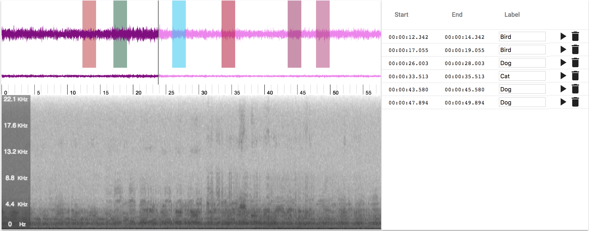

# EchoML

Play, visualize, and annotate your audio files

## Demo

[Demo Site](http://echoml.azurewebsites.net/)

## Screenshot




## Supported storage providers

* Azure blob storage

## Run

### Set variables

* Provide credential for your Azure Storage account
* Provide a MongoDB connection URL
* Provide a key to cycle and sign the cookies used for session data

#### Sample config file

config/development.json or config/production.json

```json
{
  "auth": {
    "keys": ["some secret"]
  },
  "storage": {
    "STORAGE_ACCOUNT": "<YOUR AZURE STORAGE ACCOUNT>",
    "STORAGE_ACCESS_KEY": "<YOUR AZURE STORAGE ACCOUNT ACCESS KEY>"
  },
  "mongo": {
    "url": "mongodb://0.0.0.0:27017/echoml"
  }
}
```

### Development

To start both back and front ends in one command:

```bash
npm run dev
```

Or you can start both indvidually if you want some quieter logs

Start back-end node server.

```bash
npm run server
```

Start the frontend dev server with

```bash
npm run start
```

Open your browser and connect to http://localhost:3000.

### Production

Build bundle.

```bash
npm run build
```

Start server.

```bash
npm run prod
```

Open your browser and connect to http://localhost.

### Run with Docker

To update the code and rebuild the image:

Build the docker image

```bash
docker build -t echoml .
```

To run the image, either pull my image from docker hub or use your own.

Run the docker image

```bash
docker run -p 80:80 -it ritazh/echoml:latest
```

## Acknowledgement

Leverage the awesome [waveform.js](https://github.com/katspaugh/wavesurfer.js)

## License

[MIT License](http://doge.mit-license.org)
